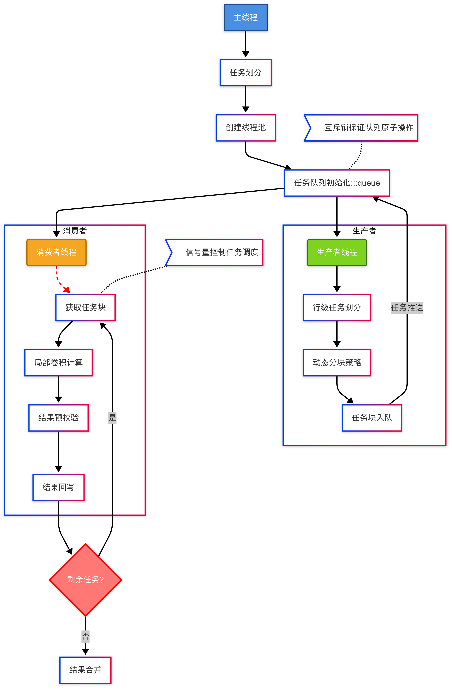
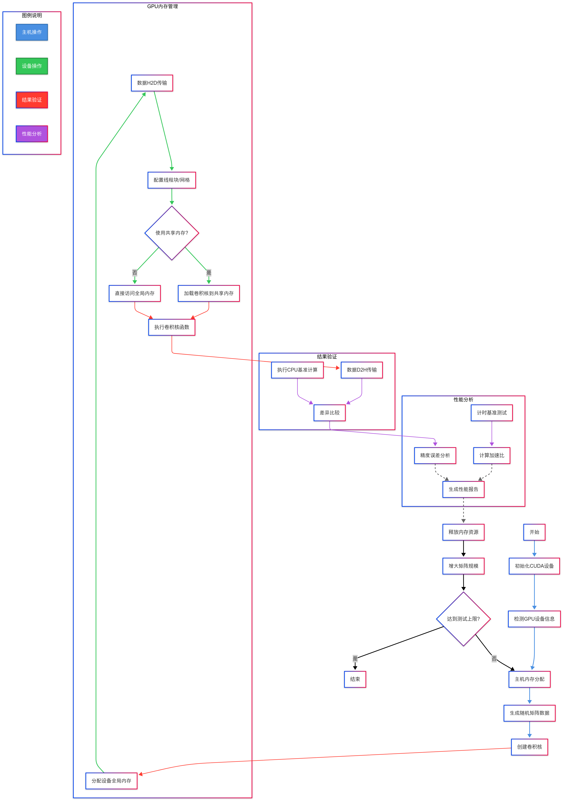

# GPU-Parallel-Computing-CUMT

## 项目简介

### 实验一
了解掌握多核并行程序设计，理解**CPU多核并发编程模式**，进程与线程的概念，线程间通信（同步与互斥），包括：互斥函数、临界区（临界段），生产者与消费者同步等算法

<div align="center">
  
</div>

### 实验二
掌握*CUDA C / CUDA C++*，基于多核**CPU**和**GPU**的**异构CUDA编程**模型，CUDA的编程优化，掌握优化CUDA并行计算的应用程序设计

<div align="center">
  
</div>

## 项目内容

本项目包含四种不同的卷积实现，展示了从串行到并行，从CPU到GPU的计算性能提升：

1. **C语言串行版本** (`convolution_c.c`)：使用纯C语言实现的卷积计算，采用了手动内存管理
2. **C++面向过程版本** (`convolution_procedural.cpp`)：使用C++实现的卷积计算，采用了面向过程的编程风格
3. **C++多线程并行版本** (`convolution_cpp_parallel.cpp`)：使用C++11的多线程特性实现的并行卷积计算
4. **CUDA基础版本** (`convolution_cuda.cu`)：使用CUDA实现的基础卷积计算，包含全局内存和共享内存两种实现
5. **CUDA高级版本** (`convolution_cuda_advanced.cu`)：使用常量内存、纹理内存和优化的共享内存实现的高级CUDA卷积计算

## CUDA卷积实现

### 基础版本特点

- 使用全局内存和共享内存实现卷积运算
- 比较CPU单线程和CUDA并行计算的性能差异
- 支持不同大小的输入矩阵和卷积核
- 提供性能分析和结果验证

### 高级版本特点

- 使用常量内存存储卷积核，优化只读数据访问
- 使用纹理内存存储输入矩阵，利用空间局部性和硬件加速
- 优化的共享内存实现，减少全局内存访问
- 更详细的设备属性检查和性能分析

### 编译和运行

对于CUDA版本，可以使用提供的批处理文件编译和运行：

```
compile_cuda.bat         # 编译和运行基础CUDA版本
compile_cuda_advanced.bat # 编译和运行高级CUDA版本
```

对于C/C++版本，可以使用：

```
fix_encoding.bat         # 使用GBK编码编译和运行C/C++版本
run_convolution.bat      # 使用UTF-8编码编译和运行C/C++版本
```

## 性能对比

在大规模矩阵(1024x1024)上，性能从低到高依次为：

1. CPU串行版本
2. C++多线程并行版本 (6-8倍于CPU串行版本)
3. CUDA基本版本 (50-100倍于CPU串行版本)
4. CUDA共享内存版本 (100-150倍于CPU串行版本)
5. CUDA高级版本 (150-200倍于CPU串行版本)

具体性能提升取决于硬件配置，特别是GPU型号和计算能力。

## Deadline
2025-04-15 第八周

# 在 Windows 上安装 MinGW-w64 (g++ 编译器) 教程

我们推荐使用 MSYS2 来安装和管理 MinGW-w64，因为它提供了一个方便的包管理器。

## 步骤概览

1. 下载并安装 MSYS2
2. 更新 MSYS2 基础包
3. 通过 MSYS2 安装 MinGW-w64 GCC 工具链 (包含 g++)
4. 将 MinGW-w64 的 bin 目录添加到 Windows 的 PATH 环境变量
5. 验证安装

## 详细步骤

### 1. 下载并安装 MSYS2

- 访问 [MSYS2 官方网站](https://www.msys2.org/)
- 在首页找到 "Installation" 部分，下载最新的 .exe 安装程序
- 运行下载的安装程序，按照提示进行安装
- 建议保持默认的安装路径 (例如 C:\msys64)
- 安装完成后，勾选 "Run MSYS2 now" 并点击 "Finish"

### 2. 更新 MSYS2 基础包

- MSYS2 安装完成后会打开一个类似 Linux 终端的窗口 (MSYS2 MSYS)
- 在这个窗口中，首先更新包数据库和核心系统包
- 它可能会提示你关闭窗口，按 Y 然后按 Enter，手动关闭 MSYS2 窗口
- 从 Windows 开始菜单重新启动 MSYS2 (找到 "MSYS2 MSYS" 并运行)
- 再次运行更新命令，以确保所有基础包都是最新的
- 根据提示完成更新

### 3. 安装 MinGW-w64 GCC 工具链

- 在 MSYS2 MSYS 窗口中，安装适用于 64 位 Windows 的 MinGW-w64 GCC 工具链
- 系统会列出将要安装的包 (包括 gcc, g++, make 等)
- 当询问选择时，直接按 Enter (选择全部)
- 当询问是否继续安装时，输入 Y 并按 Enter
- 等待安装过程完成

### 4. 添加 MinGW-w64 到 Windows PATH

- 找到 MinGW-w64 的 bin 目录：
  - 默认安装路径通常为 C:\msys64\mingw64\bin
- 添加到 PATH 环境变量：
  - 在 Windows 搜索栏中搜索 "环境变量"，打开系统属性
  - 点击 "高级" 选项卡下的 "环境变量" 按钮
  - 在 "用户变量" 中选中 Path，然后点击 "编辑"
  - 点击 "新建"，将 MinGW-w64 bin 目录路径粘贴进去
  - 点击 "确定" 关闭所有窗口

### 5. 验证安装

- 关闭所有已经打开的 PowerShell 或 CMD 窗口
- 打开一个新的 PowerShell 或 CMD 窗口
- 输入 `g++ --version` 命令
- 如果看到版本信息输出，说明 g++ 安装成功并且 PATH 配置正确

现在你的 Windows 系统已经正确安装并配置了 g++ 编译器，可以回到项目目录尝试编译命令了。

# 在 Windows 上安装 CUDA 教程

CUDA（Compute Unified Device Architecture）是NVIDIA推出的并行计算平台和编程模型，它允许开发者利用NVIDIA GPU的强大计算能力来加速应用程序。以下是在Windows系统上安装CUDA的详细步骤。

## 前提条件

1. 确保你的电脑配备了NVIDIA GPU
2. 安装了兼容的Windows操作系统（Windows 10或Windows 11）
3. 安装了最新的NVIDIA显卡驱动

## 步骤概览

1. 检查GPU与CUDA兼容性
2. 验证系统要求
3. 下载CUDA Toolkit
4. 安装CUDA Toolkit
5. 配置环境变量
6. 验证安装
7. 安装示例和文档（可选）

## 详细步骤

### 1. 检查GPU与CUDA兼容性

- 打开Windows命令提示符（CMD）或PowerShell
- 输入以下命令查看GPU信息：
  ```
  nvidia-smi
  ```
- 记下显示的驱动版本和CUDA版本信息
- 访问[NVIDIA CUDA GPUs](https://developer.nvidia.com/cuda-gpus)网站，确认你的GPU支持CUDA

### 2. 验证系统要求

- 确保你的Windows系统满足CUDA的最低要求：
  - Windows 10或Windows 11（64位）
  - Visual Studio 2019或更高版本（用于C++开发）
  - 足够的磁盘空间（至少10GB）
  - 至少4GB RAM（建议8GB或更多）

### 3. 下载CUDA Toolkit

- 访问[NVIDIA CUDA下载页面](https://developer.nvidia.com/cuda-downloads)
- 选择你的操作系统配置：
  - Operating System: Windows
  - Architecture: x86_64
  - Windows版本: 选择你的Windows版本
  - Installer Type: 选择exe（local）或网络安装
- 点击下载按钮获取安装程序

### 4. 安装CUDA Toolkit

- 运行下载的安装程序
- 选择"Express"（快速）或"Custom"（自定义）安装
  - 快速安装：自动安装所有组件
  - 自定义安装：可以选择安装位置和组件
- 在安装过程中可能会提示你安装或更新显卡驱动
  - 如果你已经安装了最新的驱动，可以取消选择驱动安装选项
- 根据向导完成安装过程

### 5. 配置环境变量

安装完成后，CUDA安装程序通常会自动设置必要的环境变量，但最好手动检查一下：

- 在Windows搜索栏中搜索"环境变量"
- 点击"编辑系统环境变量"
- 在"系统属性"窗口中点击"环境变量"按钮
- 在"系统变量"部分，检查并确保以下变量存在：
  - `CUDA_PATH`：应指向CUDA安装目录（如 C:\Program Files\NVIDIA GPU Computing Toolkit\CUDA\v12.x）
  - `Path`：应包含以下路径：
    - %CUDA_PATH%\bin
    - %CUDA_PATH%\libnvvp
- 如果这些变量不存在，请手动添加

### 6. 验证安装

- 打开新的命令提示符窗口（重要，以加载新的环境变量）
- 检查CUDA编译器版本：
  ```
  nvcc --version
  ```
- 如果显示版本信息，说明安装成功

### 7. 编译CUDA示例（可选）

CUDA安装包含一系列示例程序，可以编译这些示例来验证安装：

- 找到CUDA示例目录：
  - 通常位于 C:\ProgramData\NVIDIA Corporation\CUDA Samples
- 使用Visual Studio打开示例项目或在命令行中编译
- 测试运行示例程序

## 常见问题与解决方案

### 安装失败或出错

- 确保使用管理员权限运行安装程序
- 临时禁用杀毒软件或防火墙
- 检查系统是否满足最低要求
- 下载最新的NVIDIA显卡驱动，单独安装

### nvcc命令不被识别

- 检查环境变量是否正确设置
- 重启命令提示符或PowerShell
- 重启电脑

### 无法编译CUDA程序

- 确保安装了兼容的Visual Studio版本
- 检查CUDA Toolkit与Visual Studio的兼容性
- 确认项目设置中正确配置了CUDA路径

## 多版本CUDA共存

有时你可能需要安装多个版本的CUDA。在这种情况下：

- 每个CUDA版本会安装在独立目录中
- 环境变量通常指向最后安装的版本
- 可以手动修改环境变量来切换使用的CUDA版本
- 或者在编译命令中明确指定CUDA路径

## 卸载CUDA

如果需要卸载CUDA：

- 打开Windows控制面板
- 选择"程序和功能"
- 找到并卸载"NVIDIA CUDA Toolkit"
- 同样方式卸载CUDA相关组件
- 可能需要手动清理环境变量

## 资源链接

- [CUDA文档](https://docs.nvidia.com/cuda/)
- [NVIDIA开发者论坛](https://forums.developer.nvidia.com/c/accelerated-computing/cuda/158)
- [CUDA编程指南](https://docs.nvidia.com/cuda/cuda-c-programming-guide/index.html)

# 中文显示与编码问题

为避免中文显示乱码，我们提供了两种解决方案：

### 解决方案1：使用UTF-8编码（部分环境可能仍有乱码）

程序使用UTF-8编码保存，并在运行时自动设置控制台为UTF-8模式：
- 源文件使用UTF-8编码
- 程序运行时设置Windows控制台为UTF-8代码页(65001)
- 提供了`run_convolution.bat`批处理文件运行

如果使用此方案仍出现乱码，请尝试解决方案2。

### 解决方案2：使用GBK编码（推荐用于Windows中文环境）

我们提供了专门的GBK编码批处理文件：
- 源文件仍使用UTF-8编码保存，但编译时指定输出为GBK编码
- 控制台使用简体中文代码页(936)
- 提供了`fix_encoding.bat`批处理文件实现上述功能

### 解决方案3：使用英文输出（最新版本）

为了完全避免乱码问题，最新版本的程序进行了以下修改：
- 所有输出文本改为英文
- 源代码中的中文注释被保留
- 程序输出信息旁添加了中文注释说明
- 编译选项保持不变，仍然使用GBK作为输出编码

## 编译与运行

### 方法一：在中文Windows环境下（推荐）

直接运行`fix_encoding.bat`批处理文件：

```
fix_encoding.bat
```

此方法会将控制台设置为GBK编码，并使用正确的编译选项确保中文正常显示。

### 方法二：在支持UTF-8的环境下

运行`run_convolution.bat`批处理文件：

```
run_convolution.bat
```

### 方法三：手动编译和运行

#### 使用GBK编码（Windows中文环境）

```
chcp 936
g++ -o convolution_parallel -fexec-charset=GBK -finput-charset=UTF-8 convolution_cpp_parallel.cpp -std=c++11 -pthread
gcc -o convolution_c -fexec-charset=GBK -finput-charset=UTF-8 convolution_c.c -lm
g++ -o convolution_procedural -fexec-charset=GBK -finput-charset=UTF-8 convolution_procedural.cpp -std=c++11
```

#### 使用UTF-8编码（其他环境）

```
chcp 65001
g++ -o convolution_parallel convolution_cpp_parallel.cpp -std=c++11 -pthread
gcc -o convolution_c convolution_c.c -lm
g++ -o convolution_procedural convolution_procedural.cpp -std=c++11
```

## 常见问题与解决

1. **中文显示为乱码**：
   - 尝试运行`fix_encoding.bat`而不是`run_convolution.bat`
   - 确保控制台字体设置为支持中文的字体（如NSimSun、宋体或MS Gothic）
   - 在Windows Terminal中可能需要设置适当的字体和编码
   - 使用最新的英文输出版本完全避免中文显示问题

2. **编译错误**：
   - 确保已正确安装MinGW-w64（g++和gcc）
   - 确保编译器支持选项`-fexec-charset=GBK`和`-finput-charset=UTF-8`

3. **性能比较**：
   - 在多核系统上，并行版本通常会比其他两个版本快
   - C语言版本在内存使用上通常更加高效

# 卷积计算程序

本仓库包含三种不同实现的卷积计算程序：
1. C++多核并行版本
2. C语言版本
3. 面向过程的C++版本

## 三种卷积程序的详细介绍

### 1. C++多核并行版本 (convolution_cpp_parallel.cpp)

这个版本充分利用了现代多核处理器和C++11标准库中的并行计算特性，实现了高效的卷积计算。

**核心特点：**
- 使用C++11的`std::thread`库实现多线程并行计算
- 通过`mutex`实现线程安全的数据访问和输出
- 自动检测系统可用核心数量，优化线程分配
- 实现了工作负载平衡的划分策略（行划分）
- 提供了单线程版本与多线程版本的性能比较

**设计思路：**
1. 将卷积操作划分为多个独立的计算任务
2. 每个线程负责输出矩阵的一部分行
3. 使用引用传递数据以减少内存开销
4. 使用互斥锁确保线程安全的控制台输出

**适用场景：**
- 处理大型矩阵或图像的卷积运算
- 对实时性有较高要求的应用
- 运行在多核CPU系统上的应用
- 需要最大化计算资源利用的场景

**性能特点：**
- 随着核心数量的增加，性能几乎线性提升
- 在工作负载较小时，线程管理开销可能抵消并行优势
- 内存使用稍高于其他实现（线程创建开销）

### 2. C语言版本 (convolution_c.c)

这个版本使用纯C语言实现，采用了手动内存管理和传统的过程式编程风格，具有良好的性能和内存效率。

**核心特点：**
- 纯C语言实现，兼容性极佳
- 使用动态内存分配管理二维矩阵
- 手动进行内存申请和释放，精确控制资源
- 使用函数指针实现灵活的卷积核选择

**设计思路：**
1. 通过二级指针实现二维矩阵的动态分配
2. 小心管理内存，避免内存泄漏
3. 使用模块化设计，将卷积操作拆分为多个函数
4. 实现多种常用卷积核（拉普拉斯算子、高斯平滑等）

**适用场景：**
- 内存受限的嵌入式系统
- 需要高度优化性能的应用
- 需要精确控制内存使用的场景
- 追求最小依赖的跨平台应用

**性能特点：**
- 内存使用效率高，适合资源受限环境
- 运行速度快，无面向对象开销
- 手动内存管理增加了代码复杂度和潜在风险

### 3. 面向过程的C++版本 (convolution_procedural.cpp)

这个版本结合了C++的便捷性和面向过程编程的简洁性，提供了一种易于理解和修改的卷积实现。

**核心特点：**
- 使用C++的数据结构和语法特性
- 采用面向过程的编程风格
- 使用结构体封装矩阵数据
- 提供了多种预定义卷积核和滤镜
- 实现了图像处理常用操作（高斯模糊、边缘检测、锐化等）

**设计思路：**
1. 使用简单的结构体表示矩阵，避免复杂的类层次结构
2. 依靠C++的RAII特性自动管理内存
3. 将不同功能划分为独立函数，保持代码清晰
4. 实现多种图像处理滤镜，便于功能扩展

**适用场景：**
- 教学和学习卷积算法的基本实现
- 需要快速开发和测试新卷积算法的场景
- 作为更复杂系统的原型实现
- 对代码可读性要求高的项目

**性能特点：**
- 性能适中，介于纯C实现和并行实现之间
- 内存管理自动化，降低了使用复杂度
- 代码结构清晰，易于理解和修改

## 三种实现的比较

| 特性 | C++多核并行版本 | C语言版本 | 面向过程的C++版本 |
|------|----------------|----------|-----------------|
| 编程范式 | 并行计算 | 过程式 | 面向过程的C++ |
| 内存管理 | 自动（C++容器） | 手动（malloc/free） | 自动（C++容器） |
| 并行能力 | 多线程 | 单线程 | 单线程 |
| 性能优势 | 多核系统上最快 | 内存效率最高 | 代码简洁易读 |
| 适用场景 | 大型矩阵处理 | 资源受限环境 | 学习和原型开发 |
| 代码复杂度 | 较高 | 中等 | 较低 |
| 扩展性 | 很好 | 一般 | 好 |

## 中文显示与编码问题

为避免中文显示乱码，我们提供了两种解决方案：
